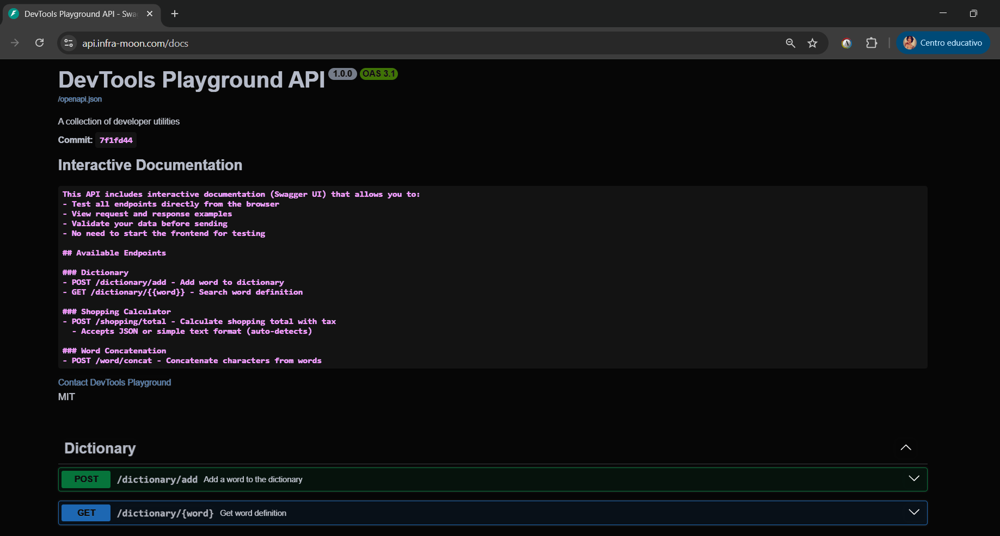
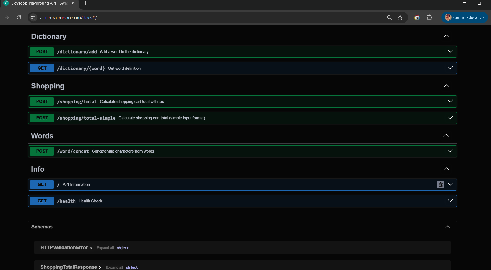

# DevTools Playground API - Backend


## EPAM Project - DevOps Specialization 
**Author:** Jazmin Luna 🌙

**Backend Built with FastAPI**

This repository is a collection of APIs for developers created with FastAPI, including three interactive programming katas: 
- Dictionary Management 
- Shopping Cost Calculator
- Word Concatenation. 

**Live Application:**
- **Frontend**: https://app.infra-moon.com/
- **API Documentation**: https://api.infra-moon.com/docs

The API includes comprehensive Swagger UI documentation for easy testing and exploration.
- Swagger:

- Endpoints available in Swagger: 

- Screenshot of Lens displaying pods:


## Katas:

### Dictionary Management
- Add words with definitions to a persistent dictionary
- Search for word definitions (case-insensitive)
- Automatic input normalization and validation
- PostgreSQL-backed storage with SQLAlchemy ORM

### Shopping Cost Calculator
- Calculate shopping cart totals with tax
- **Flexible input formats**: Accepts both JSON and simple text input
- Automatic format detection and parsing
- Detailed breakdown of costs, subtotals, and tax calculations

### Word Concatenation
- Concatenate characters from words based on position
- Extract characters intelligently (skips words that are too short)
- Returns statistics about extracted and skipped characters
--- 
### Interactive Documentation
- **Swagger UI** at `/docs` - Test endpoints directly from your browser
- **ReDoc** at `/redoc` - Alternative documentation interface
- **OpenAPI JSON** at `/openapi.json` - Machine-readable API specification

## Tech Stack

- **Framework**: FastAPI 0.104.1
- **Language**: Python 3.11
- **Database**: PostgreSQL (with SQLAlchemy ORM)
- **Migrations**: Alembic
- **Testing**: Pytest with coverage
- **Containerization**: Docker (multi-stage builds)
- **Orchestration**: Kubernetes with Helm charts
- **Cloud**: AWS (EKS, ECR, ALB, RDS)
- **Validation**: Pydantic v2
- **ASGI Server**: Uvicorn

## Prerequisites

- Python 3.11+
- PostgreSQL 12+ (for Dictionary kata)
- Docker & Docker Compose (optional, for containerized deployment)
- AWS CLI & kubectl (for Kubernetes deployment)

## Installation

### AWS/Kubernetes Deployment (Production)

The application is deployed to AWS EKS using Helm charts. In production, it connects to an AWS RDS PostgreSQL instance for database persistence.

**Prerequisites:**
- AWS CLI configured with appropriate credentials
- `kubectl` configured to access the EKS cluster
- Helm 3.x installed
- Access to the ECR repository and EKS cluster

**Deployment Steps:**

1. **Install using Helm chart**
   ```bash
   helm install devtools-backend ./helm \
     -f ./helm/values-moon-dev.yaml \
     --namespace devtools-playground \
     --create-namespace
   ```

2. **Verify deployment**
   ```bash
   kubectl get pods -n devtools-playground
   kubectl get ingress -n devtools-playground
   ```

**Production Configuration:**
- **Database**: AWS RDS PostgreSQL instance
- **Database credentials**: Managed via Kubernetes secrets (`rds-postgresql-secret`)
- **Ingress**: AWS ALB Ingress Controller with SSL/TLS termination
- **Service**: ClusterIP service exposing port 8000
- **Replicas**: Configurable via Helm values (default: 2)
- **Health Checks**: Liveness and readiness probes configured
- **Resources**: CPU and memory limits/requests defined

**Access Points:**
- **API**: https://api.infra-moon.com
- **Swagger UI**: https://api.infra-moon.com/docs
- **Frontend**: https://app.infra-moon.com

---

### Docker Deployment (Optional)

For containerized local deployment or testing:

1. **Build the Docker image**
   ```bash
   docker build -t devtools-backend:latest .
   ```

2. **Run the container**
   ```bash
   docker run -p 8000:8000 \
     -e DB_HOST=host.docker.internal \
     -e DB_PORT=5432 \
     -e DB_NAME=devtools \
     -e DB_USER=devtools \
     -e DB_PASSWORD=devtools \
     devtools-backend:latest
   ```

**Note**: This requires a PostgreSQL instance running on the host machine or accessible via `host.docker.internal`.

#### Dockerfile Overview

The project uses a **multi-stage Docker build** optimized for production deployments with security and performance best practices:

**Key Features:**

- **Multi-stage Build**: Uses a builder stage to compile dependencies, then copies only necessary artifacts to the final lightweight image
- **Base Image**: `python:3.11-slim` - Minimal Python image for reduced attack surface and smaller image size
- **Non-root User**: Runs as `appuser` (UID 1000) instead of root for enhanced security
- **Health Check**: Built-in health check endpoint that monitors `/health` every 30 seconds
- **Optimized Layers**: Dependencies are installed in separate layers for better caching
- **Minimal Dependencies**: Only includes `postgresql-client` for database connectivity, keeping the image lean
- **Proper Permissions**: All files and directories are owned by the non-root user
- **Production Ready**: Configured with appropriate timeouts, retries, and start periods for health checks

**Build Process:**
1. **Builder Stage**: Installs build dependencies (gcc) and compiles Python packages
2. **Runtime Stage**: Creates non-root user, copies application code, sets up environment, and configures health checks
3. **Final Image**: Contains only runtime dependencies and application code, optimized for size and security

**Image Size Optimization:**
- Uses `--no-cache-dir` flag to avoid storing pip cache
- Removes apt package lists after installation
- Multi-stage build eliminates build dependencies from final image

### Local Development

For local development and testing, follow these detailed steps:

#### 1. Clone the Repository

```bash
git clone <repository-url>
cd devtools-backend
```

#### 2. Create Virtual Environment

```bash
python -m venv venv
```

#### 3. Activate Virtual Environment

**Windows:**
```bash
venv\Scripts\activate
```

**Linux/Mac:**
```bash
source venv/bin/activate
```

#### 4. Install Dependencies

```bash
pip install -r requirements.txt
```

#### 5. Set Up Environment Variables

Create a `.env` file in the root directory:

```env
DB_HOST=localhost
DB_PORT=5432
DB_NAME=devtools
DB_USER=devtools
DB_PASSWORD=devtools
CORS_ORIGINS=http://localhost:5173,http://localhost:3000
```

**Note**: For local development, you can use a local PostgreSQL instance or skip the Dictionary kata if you don't need database functionality.

#### 6. Set Up Local Database (Optional - for Dictionary kata)

If you want to use the Dictionary kata, you'll need a local PostgreSQL database:

1. **Install PostgreSQL** (if not already installed)
2. **Create database and user:**
   ```sql
   CREATE DATABASE devtools;
   CREATE USER devtools WITH PASSWORD 'devtools';
   GRANT ALL PRIVILEGES ON DATABASE devtools TO devtools;
   ```

3. **Run database migrations:**
   ```bash
   alembic upgrade head
   ```

#### 7. Start Development Server

```bash
uvicorn app.main:app --reload --host 0.0.0.0 --port 8000
```

**Development Server URLs:**
- **API**: http://localhost:8000
- **Swagger UI**: http://localhost:8000/docs
- **ReDoc**: http://localhost:8000/redoc
- **Health Check**: http://localhost:8000/health

**Development Features:**
- **Auto-reload**: Code changes automatically restart the server (thanks to `--reload` flag)
- **Interactive Documentation**: Test all endpoints directly from Swagger UI
- **CORS Enabled**: Configured to work with frontend running on common development ports

## API Endpoints

### Dictionary

- **POST** `/dictionary/add` - Add a word with definition
  ```json
  {
    "word": "Python",
    "definition": "A high-level programming language"
  }
  ```

- **GET** `/dictionary/{word}` - Get word definition
  - Case-insensitive search
  - Returns 404 if word not found

### Shopping Calculator

- **POST** `/shopping/total` - Calculate shopping total with tax
  
  **JSON Format:**
  ```json
  {
    "costs": {
      "apple": 1.50,
      "banana": 0.75
    },
    "items": ["apple", "banana", "apple"],
    "tax": 0.10
  }
  ```
  
  **Simple Text Format:**
  ```json
  {
    "costs_input": "apple: 1.50, banana: 0.75",
    "items_input": "apple, banana, apple",
    "tax": 0.10
  }
  ```

### Word Concatenation

- **POST** `/word/concat` - Concatenate characters from words
  ```json
  {
    "words": ["hello", "world", "fastapi"]
  }
  ```
  
  Returns: `{"result": "hos", "characters_extracted": 3, "characters_skipped": 0}`

### Info Endpoints

- **GET** `/` - API information and links
- **GET** `/health` - Health check endpoint

## Testing

Run the test suite with coverage:

```bash
pytest
```

Run with coverage report:

```bash
pytest --cov=app --cov-report=html --cov-report=term-missing
```

View coverage report:
```bash
# HTML report
open htmlcov/index.html  # Mac/Linux
start htmlcov/index.html  # Windows
```

## Project Structure

```
devtools-backend/
├── alembic/                 # Database migrations
│   ├── versions/
│   └── env.py
├── app/
│   ├── core/                # Core application logic
│   │   ├── config.py        # Settings and configuration
│   │   ├── database.py      # Database connection
│   │   ├── exceptions.py    # Custom exceptions
│   │   └── startup.py       # Startup events
│   ├── dictionary/          # Dictionary kata
│   │   ├── crud.py          # CRUD operations
│   │   ├── db_models.py     # SQLAlchemy models
│   │   ├── repository.py    # Data access layer
│   │   ├── router.py        # API routes
│   │   ├── schemas.py       # Pydantic schemas
│   │   └── service.py       # Business logic
│   ├── shopping/            # Shopping calculator kata
│   │   ├── models.py        # Pydantic models
│   │   ├── router.py        # API routes
│   │   └── service.py       # Calculation logic
│   ├── words/               # Word concatenation kata
│   │   ├── models.py        # Pydantic models
│   │   ├── router.py        # API routes
│   │   └── service.py       # Concatenation logic
│   └── main.py              # FastAPI application
├── tests/                   # Test suite
│   ├── conftest.py          # Pytest configuration
│   ├── test_dictionary.py
│   ├── test_main.py
│   ├── test_shopping.py
│   └── test_words.py
├── helm/                    # Kubernetes Helm charts
│   └── values-moon-dev.yaml
├── .github/
│   └── workflows/           # CI/CD pipelines
│       ├── ci-cd.yml
│       └── template-*.yml   # Reusable workflows
├── Dockerfile               # Docker image definition
├── alembic.ini              # Alembic configuration
├── pytest.ini               # Pytest configuration
├── requirements.txt         # Python dependencies
└── README.md                # This file
```

## CI/CD Pipeline

The project uses GitHub Actions with a modular architecture based on reusable workflow templates. This approach significantly improves pipeline readability and maintainability by separating concerns into dedicated template files.

### Pipeline Structure

The main pipeline (`ci-cd.yml`) orchestrates the following stages using reusable workflow templates:

- **Lint & Test** (`template-lint-and-test.yml`): Python linting and unit tests
- **SonarCloud Analysis** (`template-sonarcloud-analysis.yml`): Code quality and security scanning
- **Build & Push** (`template-build-and-push.yml`): Docker image build and push to AWS ECR
- **Deploy** (`template-deploy-dev.yml`): Helm-based deployment to AWS EKS

### Benefits of Template-Based Architecture

- **Improved Readability**: The main pipeline file is concise and focuses on orchestration rather than implementation details
- **Reusability**: Templates can be shared across multiple projects or pipelines
- **Maintainability**: Changes to a specific stage only require updating the corresponding template file
- **Separation of Concerns**: Each template encapsulates a single responsibility (linting, testing, building, deploying)
- **Easier Testing**: Individual templates can be tested and validated independently

The main pipeline file acts as a high-level orchestrator, passing configuration parameters to each template workflow, making it easy to understand the overall CI/CD flow at a glance.

## Environment Variables

| Variable | Description | Default |
|----------|-------------|---------|
| `DB_HOST` | Database host | `localhost` |
| `DB_PORT` | Database port | `5432` |
| `DB_NAME` | Database name | `devtools` |
| `DB_USER` | Database user | `devtools` |
| `DB_PASSWORD` | Database password | `devtools` |
| `DATABASE_URL` | Full database URL (optional) | `None` |
| `CORS_ORIGINS` | Allowed CORS origins (comma-separated) | `http://localhost:5173,http://localhost:3000` |
| `APP_NAME` | Application name | `DevTools Playground API` |
| `APP_VERSION` | Application version | `1.0.0` |
| `GIT_COMMIT_SHA` | Git commit SHA (from CI/CD) | `None` |

## License

This project is licensed under the MIT License.

## Contributing

Contributions are welcome! Please feel free to submit a Pull Request.

1. Fork the repository
2. Create your feature branch (`git checkout -b feature/AmazingFeature`)
3. Commit your changes (`git commit -m 'Add some AmazingFeature'`)
4. Push to the branch (`git push origin feature/AmazingFeature`)
5. Open a Pull Request

## Support

For support, email jluna2554@gmail.com or open an issue in the repository.

---